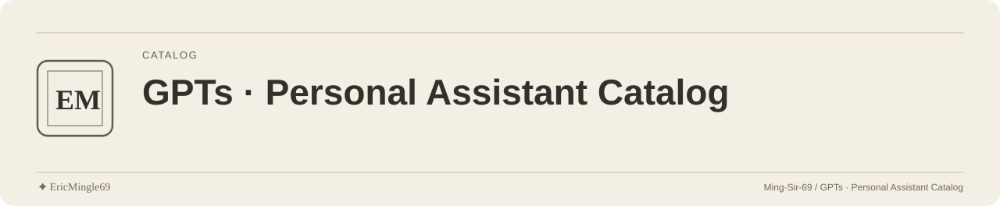

<picture>
  <source media="(prefers-color-scheme: dark)" srcset="readme-assets/header-dark.svg">
  <source media="(prefers-color-scheme: light)" srcset="readme-assets/header-light.svg">
  
</picture>

  <a href="README.md">简体中文</a> · <a href="README.en.md">English</a> · <a href="PERSONAL-NOTICE.md">✦ EricMingle69</a>

# GPTs · Personal Assistant Catalog

A home for Ming's GPTs, intended to collect custom-assistant descriptions and access entries.
It is currently a documentation starting point without individual GPT entries.

## Current contents

| Content | Status |
| --- | --- |
| Project description | This page |
| License | [LICENSE](LICENSE) |
| GPT names and access links | Not supplied |
| Prompts or programs | Not supplied |
| Release downloads | None currently |

No dependency installation or service startup is required; the repository has no executable GPT program.
ChatGPT access conditions depend on each actual GPT's settings.

## What a useful entry should describe

Future entries can be organized by purpose and specify:

- The assistant's name and a working access entry;
- Applicable tasks, expected inputs and output format;
- Known limits and platform access conditions;
- Sources for prompts, assets and external materials.

These are suggestions for catalog additions, not claims that those assistants or features already exist.
Do not submit credentials, private conversations or prompts you lack permission to publish.

## Maintenance and license

The repository retains [Apache License 2.0](LICENSE).
The catalog license does not replace GPT service conditions or add rights to third-party materials.

---

Documentation maintained by **✦ EricMingle69** · [Ming-Sir-69](https://github.com/Ming-Sir-69)  
[Personal identity, licensing and permissions](PERSONAL-NOTICE.md) · The header follows your GitHub theme.
